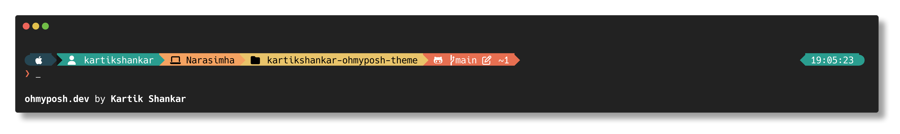

# Kartik's Oh My Posh Theme

A clean, informative prompt theme for Oh My Posh that works across multiple shells with a beautiful color palette.



## Features

- Apple icon for macOS users
- Username display with a person icon
- Computer name with a computer icon
- Root user indicator
- Current directory path with folder icon
- Git status information with Octocat icon and color indicators
- Time display on the right side
- Clean prompt character for input

## Requirements

- [Oh My Posh](https://ohmyposh.dev/) installed
- A [Nerd Font](https://www.nerdfonts.com/) installed and configured in your terminal

## Color Palette

This theme uses a beautiful, harmonious palette:
- Charcoal: `#264653`
- Persian Green: `#2a9d8f`
- Saffron: `#e9c46a`
- Sandy Brown: `#f4a261`
- Burnt Sienna: `#e76f51`

## Installation

### macOS Installation

1. Install Oh My Posh (if not already installed):
   ```bash
   brew install oh-my-posh
   ```

2. Install a Nerd Font (if not already installed):
   ```bash
   brew tap homebrew/cask-fonts
   brew install --cask font-hack-nerd-font
   ```
   
3. Configure your terminal to use the Nerd Font (e.g., "Hack Nerd Font")

4. Clone this repository:
   ```bash
   git clone https://github.com/kartikshankar/kartikshankar-ohmyposh-theme.git
   cd kartikshankar-ohmyposh-theme
   ```

5. Set up Oh My Posh to use this theme:

   #### For Bash
   Add to your `~/.bashrc`:
   ```bash
   eval "$(oh-my-posh init bash --config /path/to/kartikshankar-ohmyposh-theme/kartikshankar.omp.json)"
   ```

   #### For ZSH
   Add to your `~/.zshrc`:
   ```bash
   eval "$(oh-my-posh init zsh --config /path/to/kartikshankar-ohmyposh-theme/kartikshankar.omp.json)"
   ```

### Windows Installation

1. Install Oh My Posh using winget:
   ```powershell
   winget install JanDeDobbeleer.OhMyPosh
   ```

2. Install a Nerd Font:
   ```powershell
   oh-my-posh font install Hack
   ```

3. Configure Windows Terminal to use the Nerd Font (e.g., "Hack Nerd Font"):
   - Open Windows Terminal
   - Click on Settings (dropdown menu) > Settings
   - Select your profile (e.g., PowerShell, Command Prompt)
   - Click on "Appearance"
   - Change the font face to "Hack Nerd Font"

4. Clone this repository:
   ```powershell
   git clone https://github.com/kartikshankar/kartikshankar-ohmyposh-theme.git
   cd kartikshankar-ohmyposh-theme
   ```

5. Set up Oh My Posh to use this theme:

   #### For PowerShell
   Add to your PowerShell profile:
   ```powershell
   oh-my-posh init pwsh --config "C:\path\to\kartikshankar-ohmyposh-theme\kartikshankar.omp.json" | Invoke-Expression
   ```
   
   To create/edit your PowerShell profile if it doesn't exist:
   ```powershell
   if (!(Test-Path -Path $PROFILE)) {
     New-Item -ItemType File -Path $PROFILE -Force
   }
   notepad $PROFILE
   ```

   #### For Command Prompt
   Create a `cmd-init.lua` file:
   ```lua
   load(io.popen('oh-my-posh init cmd --config "C:/path/to/kartikshankar-ohmyposh-theme/kartikshankar.omp.json"'):read("*a"))()
   ```

### Direct Remote URL Installation

You can also use the theme directly from GitHub:

```bash
eval "$(oh-my-posh init zsh --config https://raw.githubusercontent.com/kartikshankar/kartikshankar-ohmyposh-theme/main/kartikshankar.omp.json)"
```

## Troubleshooting

- If icons don't appear correctly, make sure you have installed and configured a Nerd Font properly
- For issues with colors, ensure your terminal supports 24-bit true color
- Run `oh-my-posh debug` to verify your Oh My Posh installation

## Customization

Feel free to customize this theme to your liking by modifying the JSON configuration file. For detailed documentation on all available options, refer to the [Oh My Posh documentation](https://ohmyposh.dev/docs/configuration/overview).

## License

MIT

## Contributing

Contributions are welcome! Feel free to open an issue or submit a pull request. 