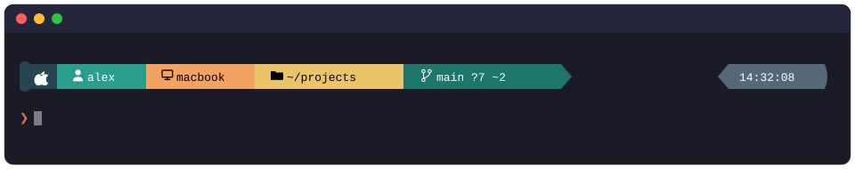
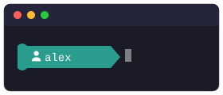
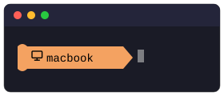
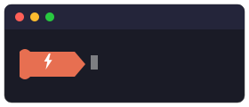
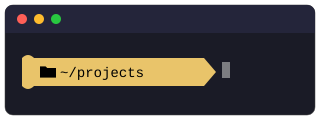
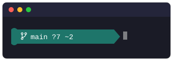
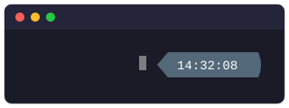
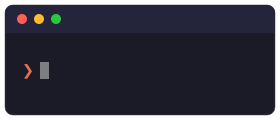

# Kartik's Oh My Posh Theme

[](https://github.com/kartikshankar-nyc/kartikshankar-ohmyposh-theme/actions/workflows/ci.yml)

A cross-platform terminal prompt for [Oh My Posh](https://ohmyposh.dev/): OS-aware icons,
colour-coded git state, and a right-aligned clock. Works in zsh, bash, PowerShell, Command
Prompt, and Git Bash on macOS, Linux, and Windows.

The installers and test suites run in CI on Linux, Windows, macOS arm64, and macOS Intel
on every push, so "works cross-platform" is a measured claim rather than an aspiration.



## Contents

- [Requirements](#requirements)
- [Install](#install)
- [Set your terminal font](#set-your-terminal-font) — **required, or you will see boxes**
- [What the prompt shows](#what-the-prompt-shows)
- [Manual installation](#manual-installation)
- [Installer options](#installer-options)
- [Customising the theme](#customising-the-theme)
- [Troubleshooting](#troubleshooting)
- [Running the tests](#running-the-tests)

## Requirements

Two things, and **both are mandatory**:

1. **Oh My Posh** — the prompt engine.
2. **A Nerd Font, installed *and* selected in your terminal.** The theme is drawn with
   Powerline separators and icon glyphs. Installing the font is not enough; your terminal
   has to be told to use it. This is the single most common reason the prompt looks
   broken, and it is a per-terminal setting the installer cannot make for you.

The installers handle step 1, install the font for step 2, and print the exact menu path
for your terminal. You still have to click it.

## Install

The installer configures the shell you actually log in with, backs up any file it edits,
and can be re-run safely.

### macOS and Linux

```bash
git clone https://github.com/kartikshankar-nyc/kartikshankar-ohmyposh-theme.git
cd kartikshankar-ohmyposh-theme
./install.sh
```

Preview the changes without writing anything:

```bash
./install.sh --dry-run
```

### Windows

```powershell
git clone https://github.com/kartikshankar-nyc/kartikshankar-ohmyposh-theme.git
cd kartikshankar-ohmyposh-theme
Set-ExecutionPolicy -ExecutionPolicy Bypass -Scope Process -Force
.\install.ps1
```

This configures PowerShell, and additionally Git Bash and Command Prompt when their
prerequisites are present. Command Prompt support requires
[Clink](https://chrisant996.github.io/clink/); the installer detects it and skips CMD with
a note if it is absent, rather than writing a config that cannot work.

Run elevated to install fonts for all users. Without elevation, fonts install for the
current user only, which is sufficient.

### Then

Restart your terminal, and **[set your terminal font](#set-your-terminal-font)**.

## Set your terminal font

Select **Hack Nerd Font** in your terminal's settings. Skipping this step is what produces
boxes, question marks, or blank gaps where icons should be.

| Terminal | Where |
|---|---|
| **iTerm2** | Settings → Profiles → Text → Font → **Hack Nerd Font** |
| macOS Terminal.app | Terminal → Settings → Profiles → Text → Font → Change… |
| Windows Terminal | Settings → your profile → Appearance → Font face |
| VS Code / Cursor | Set `terminal.integrated.fontFamily` to `Hack Nerd Font` |
| GNOME Terminal | Preferences → your profile → Text → Custom font |
| Konsole | Settings → Edit Current Profile → Appearance → Font |
| Alacritty | `font.normal.family: "Hack Nerd Font"` |
| WezTerm | `font = wezterm.font("Hack Nerd Font")` |
| Hyper | `fontFamily: '"Hack Nerd Font", monospace'` |

### iTerm2: check the non-ASCII font setting

iTerm2 has a second, easily missed font control. In **Settings → Profiles → Text**, if
**"Use a different font for non-ASCII text"** is ticked, iTerm2 renders every icon glyph
with that second font — so setting the main font to Hack Nerd Font changes nothing.

Either untick it, or set the non-ASCII font to **Hack Nerd Font** as well.

Icons are drawn from the Unicode Private Use Area, which counts as non-ASCII, so this
setting silently overrides the main font for exactly the characters this theme depends on.

## What the prompt shows

| Segment | Shows | Preview |
|---|---|---|
| OS icon | Apple, Linux, or Windows, detected at runtime<sup>1</sup> |  |
| Username | Current user |  |
| Hostname | Current machine |  |
| Root | Appears only when running as root or administrator |  |
| Directory | Current folder name |  |
| Git | Branch, staged and unstaged counts, stash count |  |
| Clock | Right-aligned, 24-hour |  |
| Prompt | Red `❯` on its own line |  |

<sup>1</sup> On Linux, Oh My Posh prefers a distribution-specific logo when it recognises the
distro — Ubuntu shows the Ubuntu mark, Fedora the Fedora mark, and so on. The generic Tux
icon configured under the `linux` key is the fallback for distributions it does not
recognise. This is Oh My Posh behaviour, not a theme setting; see the
[os segment docs](https://ohmyposh.dev/docs/segments/system/os). To force one icon
everywhere, set the distro keys explicitly in `kartikshankar.omp.json`.

### Git colours

The git segment's background encodes repository state at a glance:

| State | Colour | Hex |
|---|---|---|
| Uncommitted changes | Burnt sienna | `#e76f51` |
| Ahead **and** behind remote | Sandy brown | `#f4a261` |
| Ahead of remote | Persian green | `#2a9d8f` |
| Behind remote | Saffron | `#e9c46a` |
| Clean and in sync | Dark teal | `#1e756a` |

### Palette

| Name | Hex | Used for |
|---|---|---|
| Charcoal | `#264653` | OS icon |
| Persian green | `#2a9d8f` | Username |
| Sandy brown | `#f4a261` | Hostname |
| Saffron | `#e9c46a` | Directory |
| Burnt sienna | `#e76f51` | Root indicator, prompt character |
| Dark teal | `#1e756a` | Git (clean) |
| Slate blue | `#536878` | Clock |

## Manual installation

If you would rather not run the installer.

### 1. Install Oh My Posh

```bash
brew install oh-my-posh                        # macOS
curl -s https://ohmyposh.dev/install.sh | bash -s   # Linux
```

```powershell
winget install JanDeDobbeleer.OhMyPosh         # Windows
```

Check it: `oh-my-posh --version`

### 2. Install the Hack Nerd Font

```bash
brew install --cask font-hack-nerd-font        # macOS
oh-my-posh font install Hack                   # Linux, Windows
```

If that fails — proxy, firewall, offline machine — use the copies in [`fonts/`](fonts/),
which are the genuine upstream release files:

```bash
# macOS
cp fonts/*.ttf ~/Library/Fonts/

# Linux
mkdir -p ~/.local/share/fonts && cp fonts/*.ttf ~/.local/share/fonts/ && fc-cache -f
```

On Windows, select the four files in Explorer, right-click, and choose **Install for all
users**. See [`fonts/README.md`](fonts/README.md) for provenance and checksums.

### 3. Point your shell at the theme

Replace `/path/to` with wherever you cloned this repository.

**zsh** — `~/.zshrc`:
```bash
eval "$(oh-my-posh init zsh --config '/path/to/kartikshankar.omp.json')"
```

**bash** — `~/.bashrc`, or `~/.bash_profile` on macOS:
```bash
eval "$(oh-my-posh init bash --config '/path/to/kartikshankar.omp.json')"
```

**PowerShell** — run `notepad $PROFILE`:
```powershell
oh-my-posh init pwsh --config 'C:/path/to/kartikshankar.omp.json' | Invoke-Expression
```

**Git Bash** — `~/.bashrc`, using forward slashes:
```bash
eval "$(oh-my-posh init bash --config '/c/path/to/kartikshankar.omp.json')"
```

**Command Prompt** — requires [Clink](https://chrisant996.github.io/clink/). Create
`%USERPROFILE%\oh-my-posh.lua`:
```lua
load(io.popen('oh-my-posh init cmd --config "C:/path/to/kartikshankar.omp.json"'):read("*a"))()
```
Then set `HKCU\Software\Microsoft\Command Processor\AutoRun` to
`%USERPROFILE%\oh-my-posh.lua`.

Restart your terminal, then [set your font](#set-your-terminal-font).

## Installer options

```
./install.sh [options]

  --shell <zsh|bash|all>  Which shell(s) to configure. Defaults to your login
                          shell as reported by $SHELL.
  --no-font               Skip Nerd Font installation.
  --local                 Use the theme file next to this script instead of
                          cloning into ~/.oh-my-posh-themes.
  --dry-run               Report what would change without writing anything.
  -h, --help              Show this help.
```

`install.ps1` accepts `-NoFont`, `-Local`, and `-DryRun`.

### What the installer writes

Everything it adds to a shell config goes inside a marked block:

```bash
# >>> kartikshankar oh-my-posh theme >>>
eval "$(oh-my-posh init zsh --config '/path/to/kartikshankar.omp.json')"
# <<< kartikshankar oh-my-posh theme <<<
```

If Oh My Posh was installed somewhere your login shell does not search — the official
Linux installer defaults to `~/.local/bin` — the block also gets a `PATH` export ahead of
the `eval`, so the line cannot fail with `command not found`.

Re-running replaces exactly that block. Lines outside it are never rewritten, the file is
backed up to `<file>.bak-<timestamp>` before the first edit, and a second run with no
changes leaves the file byte-identical. To uninstall, delete the block.

## Customising the theme

Edit `kartikshankar.omp.json`. It follows the
[Oh My Posh schema](https://ohmyposh.dev/docs/configuration/overview); segment templates
use Go template syntax.

Icons are written as `\uXXXX` escapes rather than raw characters so the file stays legible
in an editor without a Nerd Font installed. Look glyphs up in the
[Nerd Fonts cheat sheet](https://www.nerdfonts.com/cheat-sheet).

Preview a change without touching your shell config:

```bash
oh-my-posh print primary --config kartikshankar.omp.json
```

A note on the schema: the theme declares `"version": 3` and uses `properties` rather than
the newer `options` key. That is deliberate — it is what `oh-my-posh config migrate`
currently emits, and it keeps the theme working on older Oh My Posh builds still shipping
in Linux distributions.

## Troubleshooting

### Boxes, question marks, or blank gaps instead of icons

Your terminal is not rendering with a Nerd Font. In order:

1. Confirm the font is installed:
   ```bash
   fc-list | grep -i "nerd font"        # Linux
   ls ~/Library/Fonts | grep -i hack    # macOS
   ```
2. Confirm your terminal is **set** to Hack Nerd Font — see
   [above](#set-your-terminal-font). Installing it does not select it.
3. On iTerm2, check the
   [non-ASCII font setting](#iterm2-check-the-non-ascii-font-setting).
4. Fully restart the terminal application. Reloading the shell is not enough; font changes
   need a new window.

### The prompt did not change at all

The theme was probably written to a file your shell does not read. Check which shell you
are actually running and which file it loads:

```bash
echo $SHELL                                   # your login shell
grep -rn "kartikshankar oh-my-posh" ~/.zshrc ~/.bashrc ~/.bash_profile 2>/dev/null
```

If `$SHELL` is `/bin/zsh` but the block landed in `~/.bash_profile`, re-run with an
explicit target:

```bash
./install.sh --shell zsh
```

macOS defaults to zsh, while `~/.bash_profile` is only read by bash. A line in the wrong
file is silently ignored — no error, no prompt.

### Colours look wrong or washed out

The theme uses 24-bit colour. Confirm your terminal supports it:

```bash
echo $COLORTERM     # expect: truecolor
```

Inside tmux, add `set -g default-terminal "tmux-256color"` and
`set -ga terminal-overrides ",*256col*:Tc"` to `~/.tmux.conf`.

### Two prompts, or a duplicated segment

Another `oh-my-posh init` line is present outside the managed block. The installer warns
when it detects one. Find and remove it:

```bash
grep -n "oh-my-posh init" ~/.zshrc ~/.bashrc ~/.bash_profile 2>/dev/null
```

### Slow shell startup

Measure it:

```bash
oh-my-posh debug --config kartikshankar.omp.json
```

The git segment is normally the most expensive part. On very large repositories, add
`"ignore_status"` to the git segment's `properties` for the paths you want skipped.

### `command not found: oh-my-posh` after installing

The install directory is not on your `PATH`. The official Linux installer defaults to
`~/.local/bin`:

```bash
export PATH="$HOME/.local/bin:$PATH"
```

Add that to your shell config above the theme block.

### Command Prompt shows an error or nothing happens

Oh My Posh in CMD requires [Clink](https://chrisant996.github.io/clink/). Install it, then
re-run `install.ps1`.

## Running the tests

```bash
./run-all-tests.sh              # everything
./run-all-tests.sh theme        # only suites matching "theme"
```

Requires `oh-my-posh` and `jq`. The suites are:

| Suite | Covers |
|---|---|
| `test-theme.sh` | Schema conformance, segment configuration, and rendered output |
| `test-dynamic-segments.sh` | Environment-driven values: OS icon, hostname, path, clock, per-shell output |
| `test-installation-scripts.sh` | Runs `install.sh` against a throwaway `HOME` and inspects the result |
| `test-comprehensive-validation.sh` | Font integrity, glyph coverage, docs, and repository hygiene |

Assertions execute the thing under test and inspect the result, rather than grepping
source files for keywords. The font checks verify the TrueType signature of each bundled
file and confirm that every glyph the theme references exists in it.

## Contributing

See [CONTRIBUTING.md](CONTRIBUTING.md). Please run `./run-all-tests.sh` before opening a
pull request.

## License

MIT — see [LICENSE](LICENSE). The bundled Hack Nerd Font files are redistributed under
their own MIT licenses; see [`fonts/README.md`](fonts/README.md).
