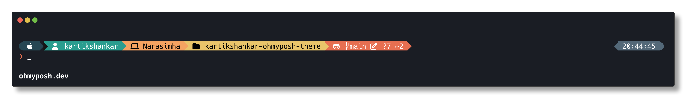

# Kartik's Oh My Posh Theme

A clean, informative prompt theme for Oh My Posh that works across multiple shells.



## Features

- Username display with a modern diamond style
- Root user indicator
- Current directory path
- Git status information with color indicators
- Language version indicators (Node.js, Go, Python)
- Current shell indicator
- Time display on the right side
- Clean prompt character for input

## Requirements

- [Oh My Posh](https://ohmyposh.dev/) installed
- A [Nerd Font](https://www.nerdfonts.com/) installed and configured in your terminal

## Installation

### Option 1: Manual Installation

1. Clone this repository:
   ```bash
   git clone https://github.com/kartikshankar/kartikshankar-ohmyposh-theme.git
   ```

2. Set up Oh My Posh to use this theme:

   #### For Bash
   Add to your `~/.bashrc`:
   ```bash
   eval "$(oh-my-posh init bash --config /path/to/kartikshankar.omp.json)"
   ```

   #### For ZSH
   Add to your `~/.zshrc`:
   ```bash
   eval "$(oh-my-posh init zsh --config /path/to/kartikshankar.omp.json)"
   ```

   #### For PowerShell
   Add to your `$PROFILE`:
   ```powershell
   oh-my-posh init pwsh --config /path/to/kartikshankar.omp.json | Invoke-Expression
   ```

### Option 2: Direct Remote URL

You can also use the theme directly from GitHub:

```bash
eval "$(oh-my-posh init zsh --config https://raw.githubusercontent.com/kartikshankar/kartikshankar-ohmyposh-theme/main/kartikshankar.omp.json)"
```

## Customization

Feel free to customize this theme to your liking by modifying the JSON configuration file. For detailed documentation on all available options, refer to the [Oh My Posh documentation](https://ohmyposh.dev/docs/configuration/overview).

## License

MIT

## Contributing

Contributions are welcome! Feel free to open an issue or submit a pull request. 